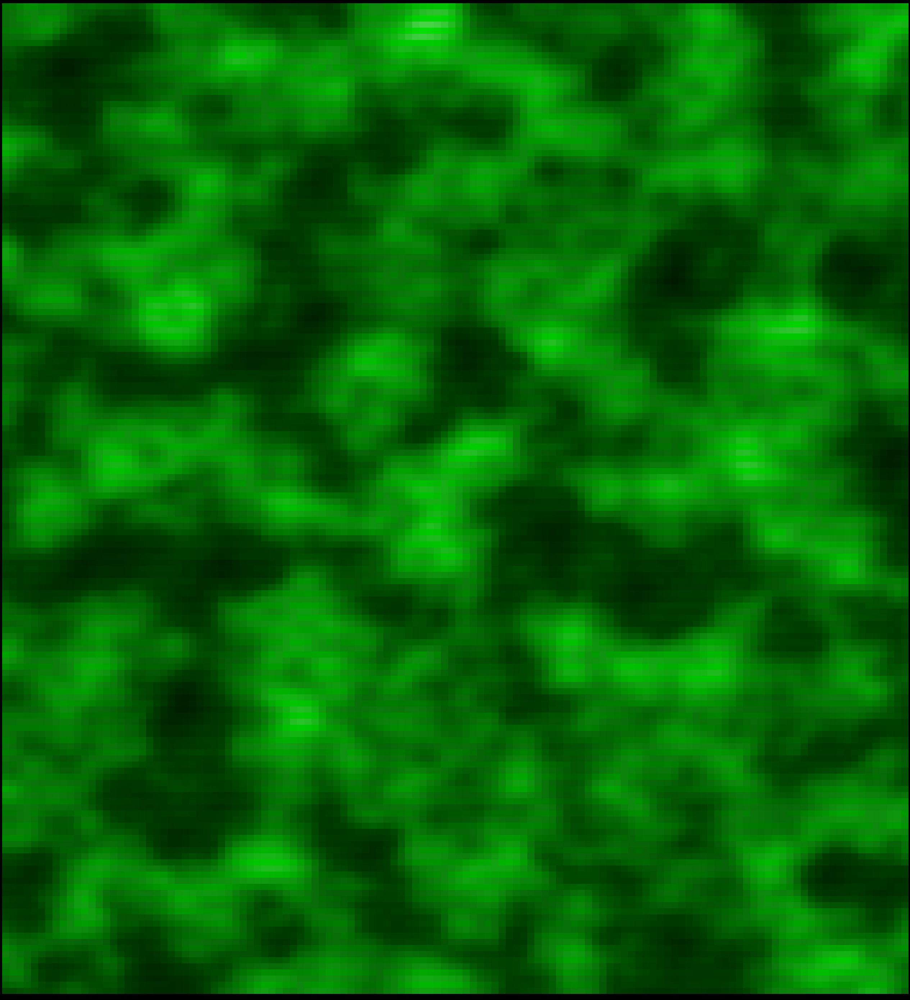

# perlin-terminal

Beautiful Perlin noise animation for your terminal. Smooth, flowing gradients rendered in 24-bit truecolor using half-block characters for double vertical resolution.



## Features

- **Truecolor rendering** — Full 24-bit RGB color gradients
- **Double vertical resolution** — Uses `▀` half-block characters to render 2 pixels per cell
- **Multiple color themes** — Ocean, Fire, Aurora, Matrix
- **Smooth animation** — Multi-octave Perlin noise for organic, flowing motion
- **60 FPS** — Optimized for smooth rendering
- **Responsive** — Handles terminal resize gracefully
- **Clean exit** — Ctrl+C / Q / Esc restores terminal state

## Install

```bash
cargo install --git https://github.com/denisepattenson/perlin-terminal
```

Or build from source:

```bash
git clone https://github.com/denisepattenson/perlin-terminal
cd perlin-terminal
cargo build --release
./target/release/perlin-terminal
```

## Usage

```bash
# Default ocean theme
perlin-terminal

# Fire theme
perlin-terminal --theme fire

# Aurora borealis
perlin-terminal --theme aurora

# Matrix-style green
perlin-terminal --theme matrix

# Customize noise and speed
perlin-terminal --theme fire --scale 0.04 --speed 0.8
```

### Options

| Flag | Default | Description |
|------|---------|-------------|
| `-t, --theme` | `ocean` | Color theme: `ocean`, `fire`, `aurora`, `matrix` |
| `-s, --scale` | `0.06` | Noise scale (smaller = more zoomed in) |
| `--speed` | `0.4` | Animation speed multiplier |
| `--fps` | `60` | Target frames per second |
| `--seed` | `42` | Perlin noise seed |

### Controls

- **Q** or **Esc** — Quit
- **Ctrl+C** — Quit

## Themes

### 🌊 Ocean
Deep navy → royal blue → teal → cyan. Calm and mesmerizing.

### 🔥 Fire
Black → deep red → orange → yellow → white. Like staring into embers.

### 🌌 Aurora
Purple → teal → green → pink. Northern lights in your terminal.

### 💚 Matrix
Black → dark green → bright green. You know the one.

## Requirements

- A terminal with 24-bit truecolor support (most modern terminals)
- Rust 1.70+

## License

MIT

